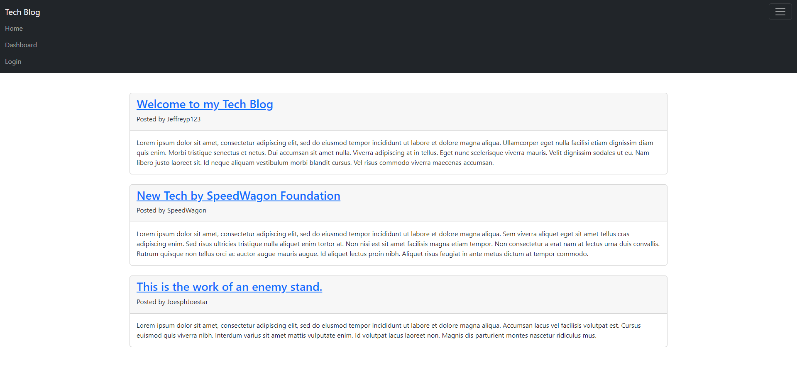
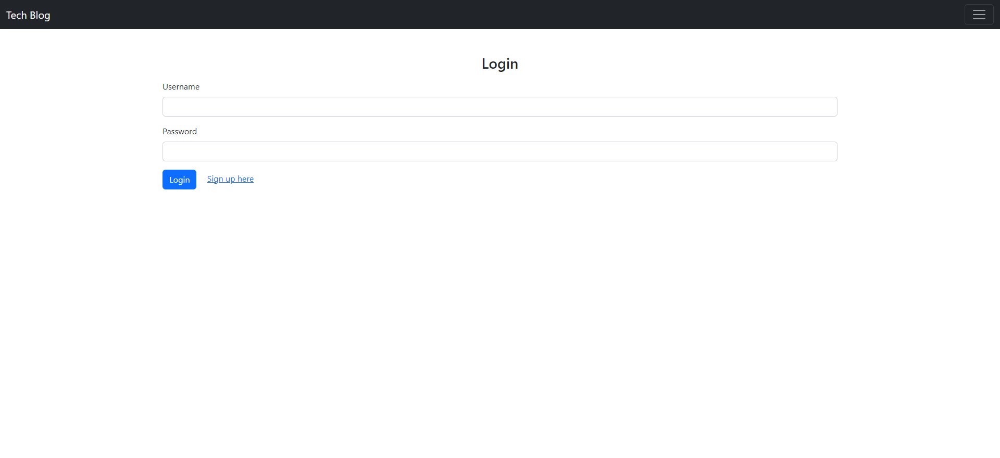

# Tech Blog

## Description
To build a CMS-style blog site, where developers can login/signup and publish their blog posts. They would also come across fellow developer's posts and can comment and interact.

## Table of Contents
- [Installation](#installation)
- [Usage](#usage)
- [Demo](#demo)
- [Technology](#technology)
- [License](#license)
- [Contribution](#contribution)
- [Tests](#tests)
- [Questions](#questions)

## Installation
- To install necessary dependencies, run the following commands:
npm i OR npm install 

- Note that the herokuapp deployment would have the dependencies installed

## Usage
- Visit the deployed application to use.

Deployed Application - 

- Users would be directed to the home page, with existing posts on display. Users can click on the posts and be redirected to a page where they can view the post and its related comments. Click on the top right button to view the dropdown navbar. From the navbar you can go back to the homepage, view dashboard or login. Users can log in or Sign up. Once user had logged in/sign up they would have access to dashboard where they can see their post histories. Logged in users would also now be able to comment on posts as well.

## Demo

## Technology
- Javascript
- MySQL
- node.js
- Bootstrap
- npm packages/dependencies include: dotenv, express, mysql2, sequelize, bycrypt, connect-session-sequelize, express-handlebars, express-sessions
- testing: Insomnia

## License
- This project is licensed under MIT license.

## Contribution
- Please contact me for any contributions.

## Tests
- There are no tests at this very moment.

## Questions
- If you have any questions feel free to contact me directly at jeffreyp2328@gmail.com. You can also find more of my work at my Github: [jpjp2328](https://github.com/jpjp2328/).

